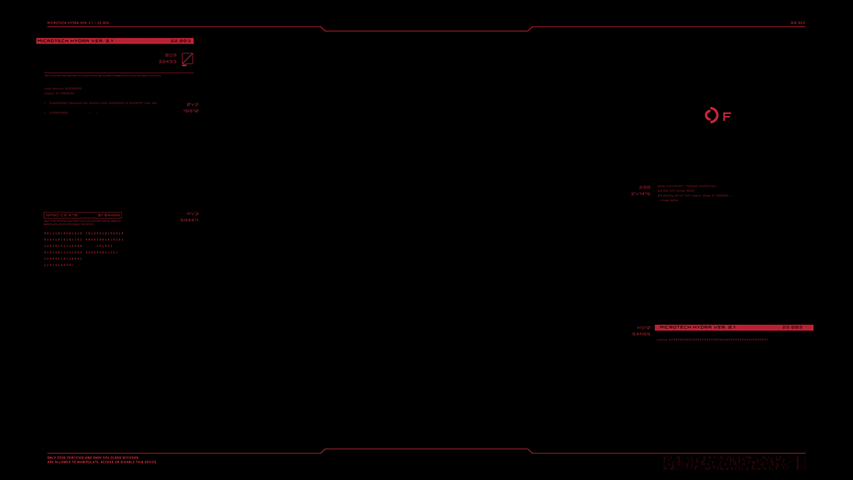

<!-- Header Section -->

  

## “Program yang baik bukanlah yang rumit, tapi yang mudah dipahami oleh manusia.” 

  

<!DOCTYPE html>
<html lang="id">
<head>
  <meta charset="UTF-8">
  <meta name="viewport" content="width=device-width, initial-scale=1.0">
  <title>AI Matrix Loader</title>
  
</head>
<body>

  

    

    
1

    
0

    
1

    
0

    
1

    
0

    
1

    
0

    
1

  

</body>
</html>
